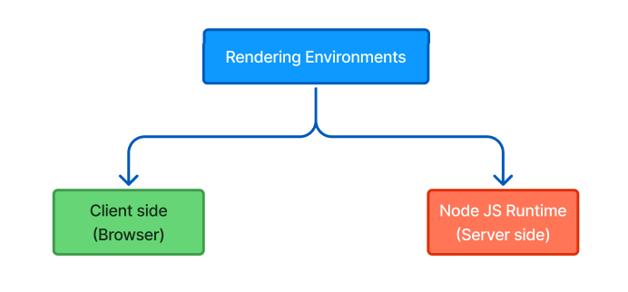

# Next JS Basics

### Create Next App

```bash
npx create-next-app@latest
```

### Project structure

```bash
app
|
|--global.css
|--layout.tsx
|--page.tsx

public
|
|--assets

other config files
...
```

The `app` folder is responsible for the file based routing. In the `app` directory `layout` is responsible to call a page dynamically using `{children}`.

### Routing and Navigation in Next.js

```bash
app/
├── users/
│   ├── page.tsx
│   ├── new/
│   │   ├── page.tsx
│
├── global.css
├── layout.tsx
├── page.tsx

public/
├── assets/

Other config files...
```

#### Next.js Routing Conventions:

- Next.js follows **file-based routing**, not configuration-based routing like `react router`.
- Every folder inside the `app/` directory should contain a `page.tsx` file to be a valid route.
- Multiple `page.tsx` files in the same directory will cause a conflict and result in an error.
- Multiple files in another extentions `css,js,...` can not be accessible through route
- Folder and file names should be **lowercase** for consistency.
- Nested routes are created by placing `page.tsx` inside subfolders (e.g., `app/users/new/page.tsx` maps to `/users/new`).

---

#### Navigation

| **Link (Next.js)**                                                                       | **Anchor (HTML)**                                                                          |
| ---------------------------------------------------------------------------------------- | ------------------------------------------------------------------------------------------ |
| `<Link href="/users/new">Users with Link</Link>`                                         | `<a href="./users/new">Users with anchor</a>`                                              |
| Only file content is being downloaded                                                    | Every assets is being redownloaded                                                         |
|  |  |

### Component rendering

#### Next js rendering


Next js supports both `client-side` and `server-side` rendering.

| **CSR**            | **SSR**            |
| ------------------ | ------------------ |
| Large bundles      | Smaller bundles    |
| Resource intensive | Resource efficient |
| NO SEO             | SEO                |
| Less secure        | More secure        |

SSR **cannot**:
- Listen to browser events  
- Access the `window`, `document`, or `localStorage` (since they are client-side APIs)  
- Maintain React state using `useState` and `useEffect` (since these run on the client)  

👉 To handle these, use **Client Components** depending on the situation. 
